# PetTask

## Integrantes

- **Líder:** Espinoza Cuevas Diego Omar
- Alvarez Del valle Angel
- Dector Montiel Norma Angelica
- Hernandez Camargo Bryan Yael
- Nolasco Gómez Jose Daniel
- Ordaz Cano Mariana
- Sandoval Resendiz Alexander Emir
- Zarate Garrido Adolfo Alexander 

---

## Descripción

**PetTask** es una aplicación web orientada a estudiantes que permite organizar y gestionar sus tareas académicas de una manera sencilla y visual.

La aplicación permite registrar, consultar, actualizar y eliminar tareas, además de incorporar elementos de gamificación mediante una mascota virtual, una tienda, una racha de actividad y recordatorios.

---

## Objetivo

El objetivo de PetTask es facilitar la organización de las actividades académicas del usuario mediante una aplicación web responsive que combine la gestión de tareas con elementos de gamificación.

La aplicación busca motivar al usuario a mantener una actividad constante mediante una mascota virtual, niveles, rachas y otras funciones relacionadas con el cumplimiento de tareas.

---

## Tecnologías utilizadas

- HTML5
- CSS3
- JavaScript
- Bootstrap 5.3.8
- Bootstrap Icons
- Google Fonts
  - Questrial
  - Onest
- Git
- GitHub

---

## Características principales

PetTask cuenta con las siguientes funcionalidades:

- Inicio de sesión.
- Registro de usuario.
- Carga de datos generales.
- Consulta de tareas.
- Agregar tareas.
- Actualizar tareas.
- Eliminar tareas.
- Interacción con mascota virtual.
- Tienda de mascota.
- Racha de actividad.
- Recordatorios.
- Diseño responsive para computadora y dispositivos móviles.

---

## Requerimientos funcionales

| RF-001 | Inicio de sesión         |
| RF-002 | Registrarse              |
| RF-003 | Carga de datos general   |
| RF-004 | Ver tareas               |
| RF-005 | Agregar tareas           |
| RF-006 | Actualizar tarea         |
| RF-007 | Eliminar tareas          |
| RF-008 | Interacción con mascota  |
| RF-009 | Tienda de mascota        |
| RF-010 | Racha de actividad       |

---

## Componentes de Bootstrap utilizados

El proyecto utiliza diferentes componentes y utilidades de Bootstrap para construir la interfaz:

- Containers.
- Grid mediante `row` y `col`.
- Cards.
- Formularios.
- Inputs.
- Textareas.
- Botones.
- Alerts.
- Badges.
- Modales.
- Navbar.
- Responsive utilities.

Estos componentes permiten mantener una estructura responsive y consistente entre las diferentes páginas del proyecto.

---

## Diseño

PetTask utiliza una guía de diseño basada en **Material Design**, buscando mantener una interfaz coherente, accesible y adaptable a diferentes tamaños de pantalla.

### Paleta de colores

| Color       | Código    | Uso                               |
| Fondo       | `#E5EAF5` | Fondo principal                   |
| Blanco      | `#FFFFFF` | Tarjetas y elementos de contenido |
| Rosa        | `#FF6F82` | Acciones y elementos destacados   |
| Azul claro  | `#8FA3ED` | Bordes y elementos secundarios    |
| Azul        | `#557FFC` | Elementos principales             |
| Azul oscuro | `#1E1E50` | Textos y títulos                  |

### Tipografías

- **Questrial:** títulos y encabezados.
- **Onest:** contenido, formularios, botones y elementos de navegación.

---

## Estructura del proyecto

```text
PetTask/
├── index.html
├── nosotros.html
├── servicios.html
├── contacto.html
├── README.md
├── css/
│   ├── estilos.css
│   ├── iniciar-sesion.css
│   ├── registro.css
│   ├── carga-de-datos-general.css
│   ├── ver-tareas.css
│   ├── agregar-tareas.css
│   ├── actualizar-tarea.css
│   ├── eliminar-tareas.css
│   ├── interaccion-con-mascota.css
│   ├── tienda-de-mascota.css
│   ├── racha-de-actividad.css
├── js/
│   └── app.js
├── img/
│   └── (imágenes del proyecto)
├── docs/
│   ├── SRS.pdf
│   ├── SRS.tex
│   ├── Guia_Diseno.pdf
│   └── Guia_Diseno.tex
└── html/
    ├── iniciar-sesion.html
    ├── registro.html
    ├── carga-de-datos-general.html
    ├── ver-tareas.html
    ├── agregar-tareas.html
    ├── actualizar-tarea.html
    ├── eliminar-tareas.html
    ├── interaccion-con-mascota.html
    ├── tienda-de-mascota.html
    ├── racha-de-actividad.html
```

---

## Instrucciones para visualizar el proyecto
### Opción 1: Abrir directamente
1. Descargar o clonar el repositorio.
2. Abrir la carpeta del proyecto.
3. Abrir `index.html` en un navegador web.

### Opción 2: Visual Studio Code
1. Clonar o descargar el repositorio.
2. Abrir la carpeta `PetTask` en Visual Studio Code.
3. Abrir `index.html`.
4. Ejecutar el proyecto utilizando una extensión como **Live Server**.
5. Visualizar la aplicación desde el navegador.

---

## Diseño responsive
PetTask está diseñado para adaptarse a diferentes tamaños de pantalla.
Se realizaron ajustes para:
- Computadoras de escritorio.
- Tablets.
- Teléfonos móviles.
Las tarjetas, formularios, botones, listas y demás elementos de la interfaz se reorganizan dependiendo del tamaño disponible.

### Capturas de escritorio
Pendiente de agregar las capturas del proyecto en computadora.


### Capturas de móvil
Pendiente de agregar las capturas del proyecto en teléfono móvil.
### Capturas de móvil
<p align="center">
  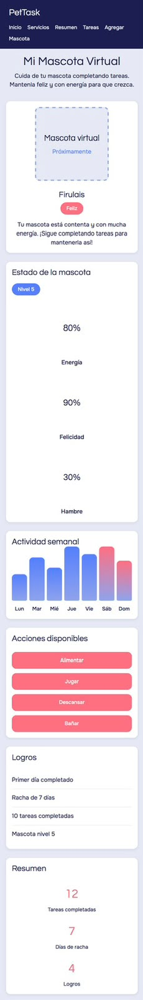 
  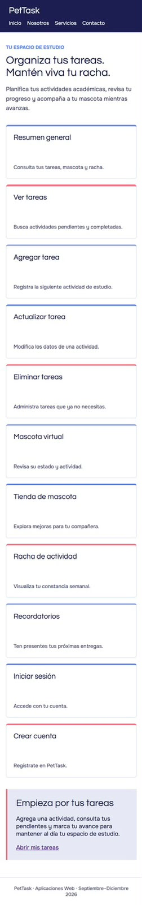
  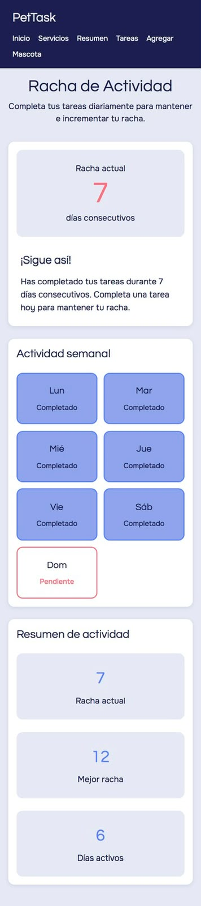
  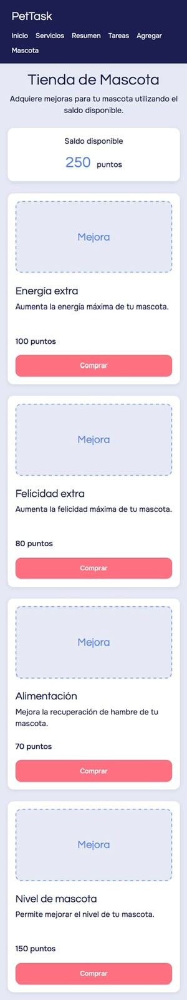
  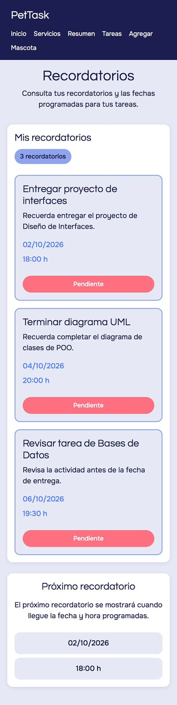
  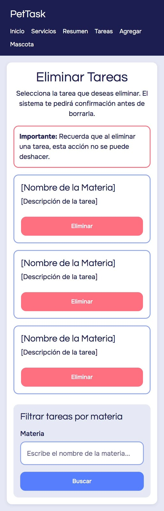
  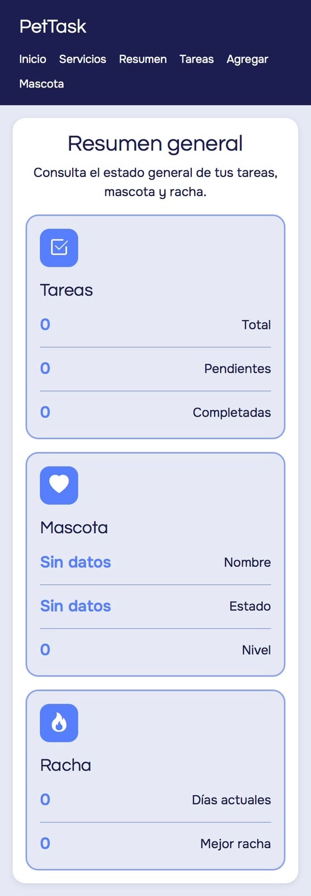
  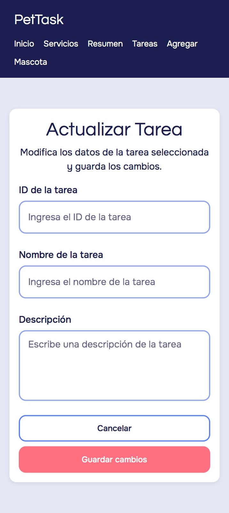
  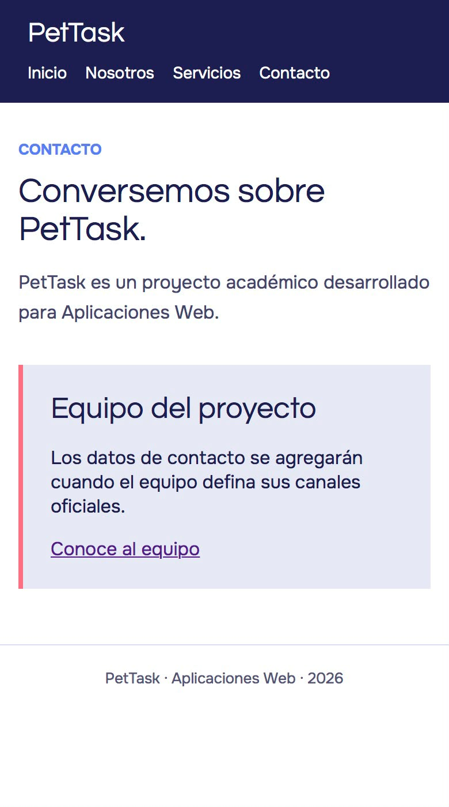
  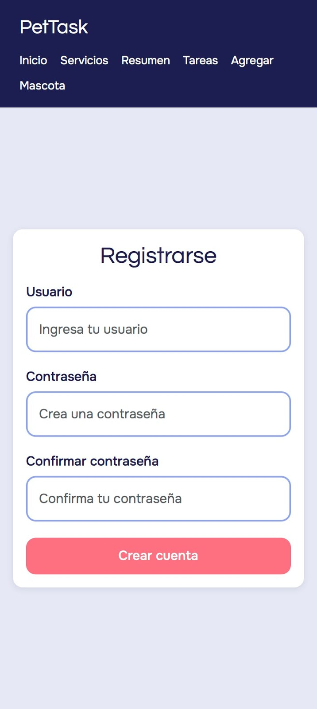
  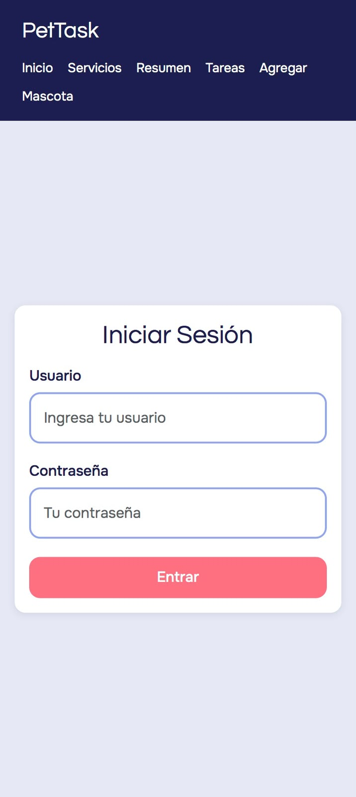
  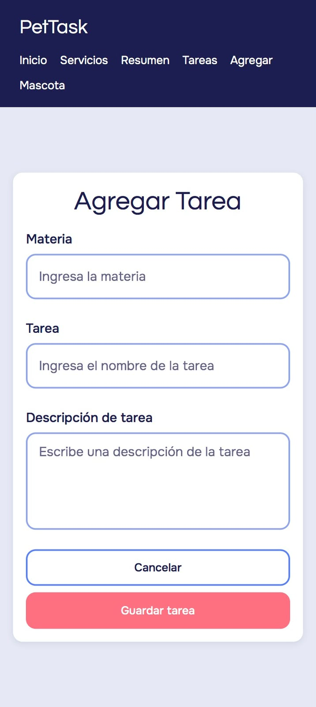
  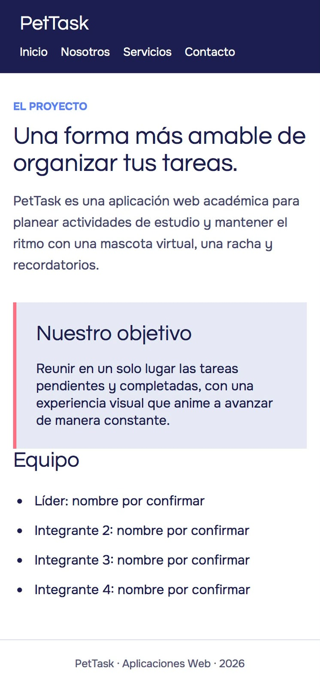
</p>

## Repositorio
El proyecto se encuentra desarrollado utilizando Git y GitHub para llevar un control progresivo del desarrollo.
El repositorio contiene las diferentes versiones y avances realizados durante la construcción de PetTask.
**Repositorio:** [PetTask en GitHub](https://github.com/HolaSoyNickName/PetTask)

---

## Documentación
La carpeta `docs/` contiene los documentos PDF y sus fuentes LaTeX:
- **SRS.pdf / SRS.tex:** Especificación de Requisitos de Software.
- **Guia_Diseno.pdf / Guia_Diseno.tex:** Guía de diseño de PetTask.
---

## Proyecto académico
**PetTask**
Aplicaciones Web
Septiembre – Diciembre 2026
